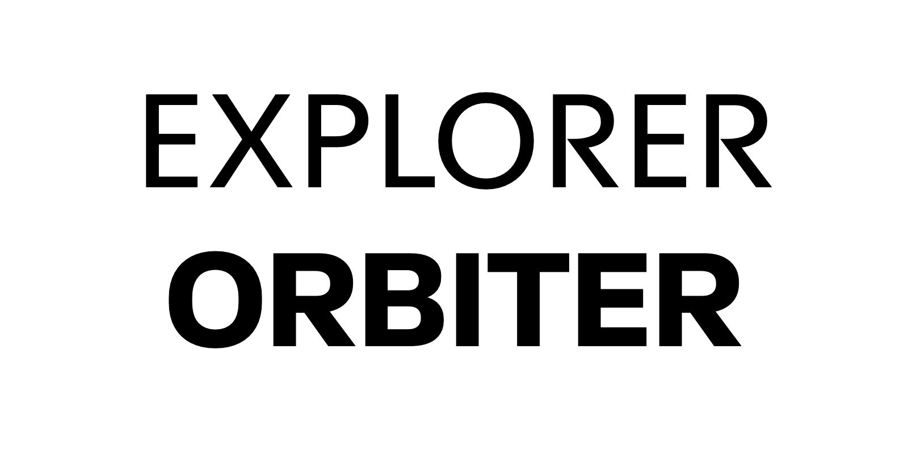
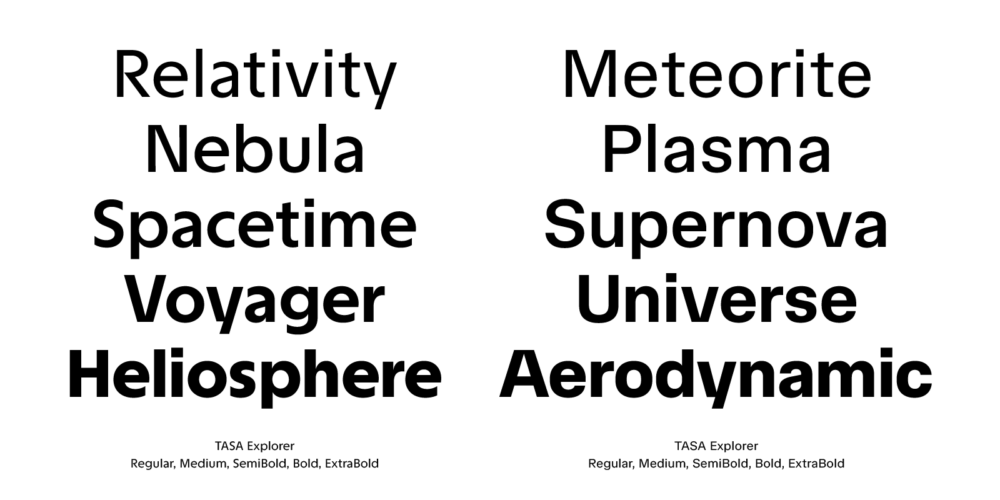
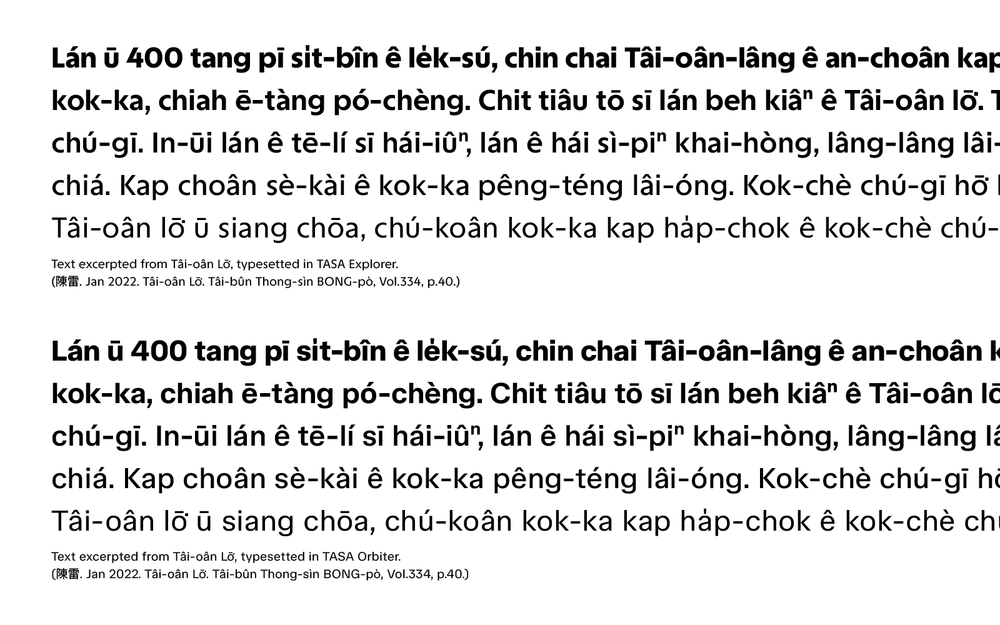

# TASA Typeface Collection

[![][E-Fontbakery]](https://adrianzwz.github.io/TASA-Typeface-Collection/fontbakery/TASAExplorer-fontbakery-report.html)
[![][O-Fontbakery]](https://adrianzwz.github.io/TASA-Typeface-Collection/fontbakery/TASAExplorer-fontbakery-report.html)

[E-Fontbakery]: https://img.shields.io/endpoint?url=https%3A%2F%2Fraw.githubusercontent.com%2Fadrianzwz%2FTASA-Typeface-Collection%2Fgh-pages%2Fbadges%2FTASAExplorer%2Foverall.json&label=FontBakery%20QA%20(Explorer)
[O-Fontbakery]: https://img.shields.io/endpoint?url=https%3A%2F%2Fraw.githubusercontent.com%2Fadrianzwz%2FTASA-Typeface-Collection%2Fgh-pages%2Fbadges%2FTASAExplorer%2Foverall.json&label=FontBakery%20QA%20(Orbiter)

The TASA Typeface Collection is a suite of two typefaces, TASA Explorer and TASA Orbiter, originally designed for [Taiwan Space Agency(TASA)](https://www.tasa.org.tw/en-US), and released under the SIL Open Font License.

TASA Explorer is a geometric sans-serif designed to echo the adventurous spirit of space exploration. Its vertically cut terminals and sharp-angled corners lend a bold, assertive character that commands attention. Subtle contrast between thick and thin strokes adds visual fluidity, preventing the geometric structure from feeling rigid.

TASA Orbiter takes a more pragmatic approach, reflecting the technical precision required in space operations. The neo-grotesque design is built from a systematic vocabulary of recurring shapes, featuring slightly squarish counters and right-angled turns.

Both typefaces are available in 5 weights (Regular, Medium, SemiBold, Bold, ExtraBold) and can be used as either static font files or variable fonts with a weight axis.

### version 1 (2023) –– Original Release
The original TASA typefaces were designed between 2022–2023 as part of the comprehensive [rebrand project](https://www.localremote.co/projects/taiwan-space-agency) for the Taiwan Space Agency.

**TASA Explorer** (v1) was released with 5 weights, designed only for display use. The design featured an extremely large x-height with minimal optical adjustments for maximum impact at large sizes.

**TASA Orbiter** (v1) had a more complex system of 13 styles across 3 optical sizes. Text and Deck had 4 weights, and Display had 5 weights.

Files of version 1 can still be found in the [releases](https://github.com/adrianzwz/TASA-Typeface-Collection/releases/tag/v1.001) section, but are no longer maintained.

### version 2 (2025) –– Redesign
In 2025, both typefaces received a complete redesign focused on preserving their design characteristics while significantly improving drawing quality and readability in small sizes.

**TASA Explorer** underwent a overhaul, redrawn with slightly lower x-height and smoother letterforms. The spacing is more relaxed and texture is more even, dramatically improving performance at text sizes, making it suitable for both display and text applications.

**TASA Orbiter** was simplified and refined, with the optical size variants removed, reducing styles from 13 to 5 weights, in line with Explorer. The new design is based on the previous "deck" optical size, with refined letterforms and spacing.

Both typefaces now support the Google Fonts Core Latin character set, plus additional glyphs to support Taiwanese Romanizations ([Tâi-lô](https://en.wikipedia.org/wiki/T%C3%A2i-u%C3%A2n_L%C3%B4-m%C3%A1-j%C4%AB_Phing-im_Hong-%C3%A0n) & [POJ](https://en.wikipedia.org/wiki/Pe%CC%8Dh-%C5%8De-j%C4%AB)).

## Contributions and Issues
To contribute, feel free to fork this project. For errors and suggestions, please create an [Issue](https://github.com/adrianzwz/TASA-Typeface-Collection/issues).

## Building

Fonts are built automatically by GitHub Actions - take a look in the "Actions" tab for the latest build.

If you want to build fonts manually on your own computer:

* `make build` will produce font files.
* `make test` will run [FontBakery](https://github.com/googlefonts/fontbakery)'s quality assurance tests.
* `make proof` will generate HTML proof files.

The proof files and QA tests are also available automatically via GitHub Actions - look at <https://adrianzwz.github.io/TASA-Typeface-Collection/>.

## Changelog

**15 Feb 2023. Version 1.0**
- Initial release.

**12 May 2023. Version 1.001**
- Removed overlaps on glyphs U+2194, U+2195.

## Acknowledgements

Thanks to Kiàn-tiong and GoRong for generously sharing their expertise on implementing and designing glyphs for Taiwanese Romanizations.

Thanks to TienMin and Troy for providing guidance and suggestions on the original design.

Thanks to the team at Local Remote and everyone involved in the original TASA rebrand project, allowing this project to happen.

Thanks to the scientists and staff at TASA. Though you may not be familiar with typography, but your respect of different expertise and open-minded approach has been a large supporting force in the process. Seeing the fonts being implemented not only on the website, but also in Instagram posts and other applications is a surreal feeling.

Thanks to all who provided feedback and encouragements throughout the design process and following the public release.

## About the authors

**Local Remote** is a design studio based in Taiwan, aiming to create the future of brand experience through innovative, immersive, experiential, and multi-sensory storytelling across virtual & physical experience.  
[contact@localremote.co](mailto:contact@localremote.co) / <https://localremote.co/>

**Weizhong Zhang** is an independent type & graphic designer based in Taiwan.  
[adrianzwz@outlook.com](mailto:adrianzwz@outlook.com) / <https://azwz.work/>

## License

This Font Software is licensed under the SIL Open Font License, Version 1.1.  
This license is available with a FAQ at https://openfontlicense.org

## Repository Layout

This font repository structure is inspired by [Unified Font Repository v0.3](https://github.com/unified-font-repository/Unified-Font-Repository), modified for the Google Fonts workflow.

## Links
- [Taiwan Space Agency](https://www.tasa.org.tw/en-US)
- [Rebrand Project (Local Remote)](https://www.localremote.co/projects/taiwan-space-agency)
- [Rebrand Project (Rytass)](https://rytass.com/projects/TASA)
- [ButTaiwanKit | But的台灣字型工具](https://github.com/ButTaiwan/GlyphsTools/tree/main/ButTaiwanKit)
- [Formosan Languages Diacritics in Glyphs | 讓字型支援台客族語！本土語言調號的設定指南 - justfont blog](https://blog.justfont.com/2024/12/formosan_languages_diacritics_in_glyphs/)
- [Tâi-uân Lô-má-jī Phing-im Hong-àn - Wikipedia](https://en.wikipedia.org/wiki/T%C3%A2i-u%C3%A2n_L%C3%B4-m%C3%A1-j%C4%AB_Phing-im_Hong-%C3%A0n)
- [Pe̍h-ōe-jī - Wikipedia](https://en.wikipedia.org/wiki/Pe%CC%8Dh-%C5%8De-j%C4%AB)
