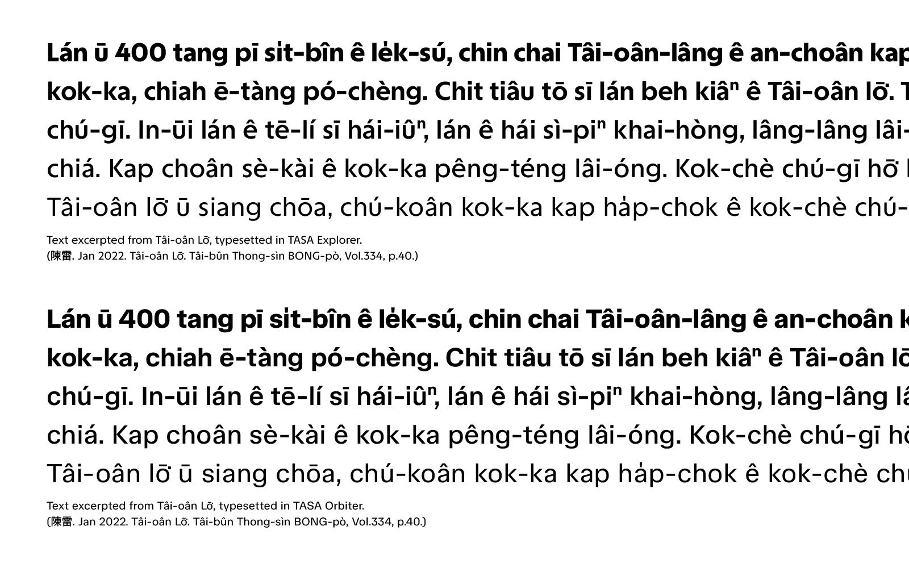

# TASA Typeface Collection

[![][E-Fontbakery]](https://adrianzwz.github.io/TASA-Typeface-Collection/fontbakery/TASAExplorer-fontbakery-report.html)
[![][O-Fontbakery]](https://adrianzwz.github.io/TASA-Typeface-Collection/fontbakery/TASAExplorer-fontbakery-report.html)

[E-Fontbakery]: https://img.shields.io/endpoint?url=https%3A%2F%2Fraw.githubusercontent.com%2Fadrianzwz%2FTASA-Typeface-Collection%2Fgh-pages%2Fbadges%2FTASAExplorer%2Foverall.json&label=FontBakery%20QA%20(TASA%20Explorer)
[O-Fontbakery]: https://img.shields.io/endpoint?url=https%3A%2F%2Fraw.githubusercontent.com%2Fadrianzwz%2FTASA-Typeface-Collection%2Fgh-pages%2Fbadges%2FTASAExplorer%2Foverall.json&label=FontBakery%20QA%20(TASA%20Orbiter)

The TASA Typeface Collection consists of TASA Explorer and TASA Orbiter, two bespoke typefaces designed for the rebrand of Taiwan Space Agency.

<!--  -->

### version 2 (2025)
In 2025, both fonts recieved a complete redesign. In version 1, TASA Orbiter included an optical size axis, which is removed in v2. The number of styles is reduced from 13 to 5.
Both fonts now support the Google Fonts Core Latin character set, plus additional glyphs to support Taiwanese Romanizations ([Tâi-lô](https://en.wikipedia.org/wiki/T%C3%A2i-u%C3%A2n_L%C3%B4-m%C3%A1-j%C4%AB_Phing-im_Hong-%C3%A0n) & [POJ](https://en.wikipedia.org/wiki/Pe%CC%8Dh-%C5%8De-j%C4%AB))

## Building

Fonts are built automatically by GitHub Actions - take a look in the "Actions" tab for the latest build.

If you want to build fonts manually on your own computer:

* `make build` will produce font files.
* `make test` will run [FontBakery](https://github.com/googlefonts/fontbakery)'s quality assurance tests.
* `make proof` will generate HTML proof files.

The proof files and QA tests are also available automatically via GitHub Actions - look at https://adrianzwz.github.io/TASA-Typeface-Collection.

## Changelog

**15 Feb 2023. Version 1.0**
- Initial release.

**12 May 2023. Version 1.001**
- Removed overlaps on glyphs U+2194, U+2195.

## License

This Font Software is licensed under the SIL Open Font License, Version 1.1.
This license is available with a FAQ at https://openfontlicense.org

## Repository Layout

This font repository structure is inspired by [Unified Font Repository v0.3](https://github.com/unified-font-repository/Unified-Font-Repository), modified for the Google Fonts workflow.

---

## About the authors

#### Local Remote
Local Remote is a design studio based in Taiwan, aiming to create the future of brand experience through innovative, immersive, experiential, and multi-sensory storytelling across virtual & physical experience.
<https://localremote.co/>

#### Weizhong Zhang
Weizhong Zhang is an independent type & graphic designer based in Taiwan.
[adrianzwz@outlook.com](mailto:adrianzwz@outlook.com)